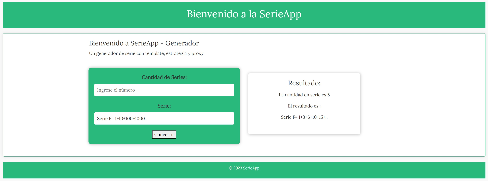
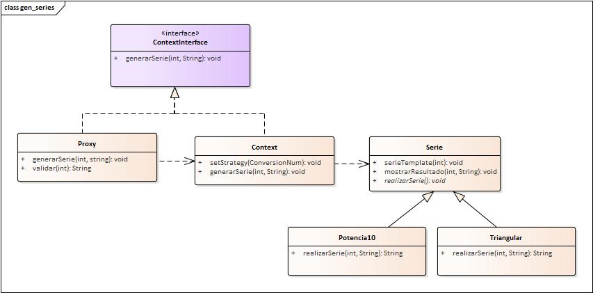

# Aplicación Web de Generador de Series con Patrones de Diseño

Esta es una aplicación web que genera series triangulares y de potencias de 10.

Fue creada con patrones de diseño, incluyendo el método de plantilla, el control de acceso por proxy y la estrategia.

[Inglés](./README.md) | [Español](./README.es.md) | [Francés](./README.fr.md) | [日本語](./README.jp.md)

## Características

- **Genera N series de números triangulares y de potencias de 10.**

## Estructura del Proyecto

El proyecto sigue la estructura del patrón MVC:

- **Modelo:** Contiene interacciones con la base de datos, lógica de negocio y modelos de datos.

- **Vista:** Incluye la capa de presentación responsable de renderizar HTML e interfaces de usuario.

- **Controlador:** Gestiona la lógica central de la aplicación, maneja solicitudes y orquesta el flujo de datos.

- **Public:** Almacena activos públicos como CSS, JavaScript e imágenes.

## Instalación

1. Clona este repositorio en el directorio de tu servidor web:

    ```bash
    https://github.com/LeoMogiano/generador-serie.git
    ```

2. Ejecuta el servidor y abre la aplicación en tu navegador.

    ```bash
    php -S localhost:8080 -t public
    ```

## Capturas de Pantalla

*Tablero*



*Diagrama Dinámico*



## Contribución

¡Las contribuciones son bienvenidas! Si deseas contribuir a este proyecto, bifurca el repositorio, realiza tus cambios y envía una solicitud de extracción.

## Licencia

Este proyecto es de código abierto y está disponible bajo la [Licencia MIT](LICENSE). Eres libre de usarlo y modificarlo según tus necesidades de administración eclesiástica.

## Contacto

Si tienes alguna pregunta o necesitas asistencia, no dudes en contactarnos.

¡Disfruta usando la aplicación!
